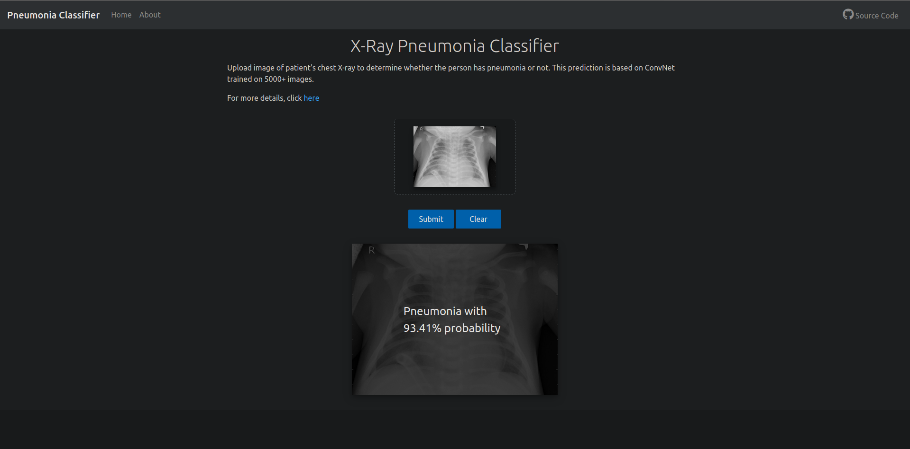
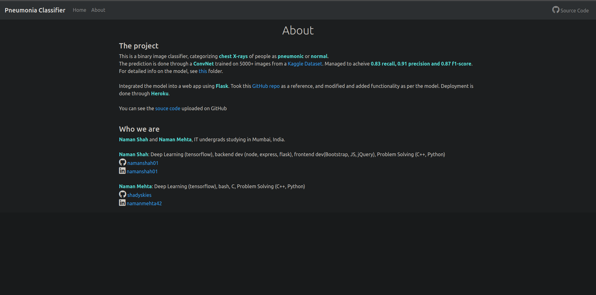

<h1 align ='center'> PNEUMONIA CLASSIFIER </h1>

 

 

<b>Personal Project </b>

<h2>About:</h2>
This is a project based on Convolution Neural Networks made using Tensorfow. The model is trained on >5000 images obtained from a Kaggle dataset available <a href = 'https://www.kaggle.com/paultimothymooney/chest-xray-pneumonia'>here</a>. It makes use of MaxPooling and BatchNormalization layers to finally result in a model that has 91% precision and 87% f1-score.
 

<h2 align = 'center'>Tech stacks used</h2>
Backend: Flask and deployed on Heroku
frontend: HTML, CSS, JS, Bootstrap
Model: Tensorflow, Python, cv2
 
<strong>The app can be found <a href ='https://pnclassify.herokuapp.com/'>here</a></strong>
 
Following are the screenshots of the deployed website

